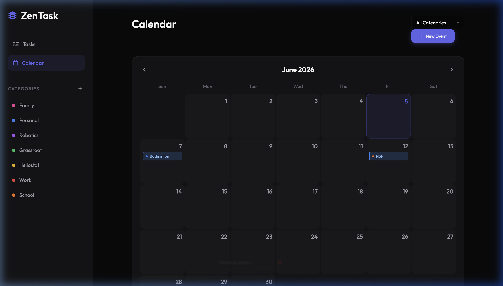

# ZenTask
A modern, dark-themed calendar and task management application that synchronizes state to a local JSON file.



**[▶️ Try it Locally](http://localhost:4000)**

## Quick Start
```bash
npm install
npm start
```
Then open `http://localhost:4000` in your browser.

## Features
- **Task Management:** Create, categorize, and seamlessly track incomplete and completed tasks.
- **Calendar View:** Visualize tasks, events, and recurring schedules dynamically on a monthly grid.
- **Recurring Events:** Set daily, weekly, biweekly, monthly, or yearly recurrences with optional end dates.
- **Rich Event Details:** Specify start and end times and add deep descriptive details for comprehensive scheduling.
- **Dynamic Filtering:** Instantly sort and filter your views by category, specific date ranges, or days of the week.

## How to run it locally

**Requirements:**
- Node.js (v18 or higher recommended)

**Setup:**
```bash
git clone https://github.com/CODERTG2/mytodolist.git
cd mytodolist
npm install
npm start
```
The Express server will start on port `4000`. By default, the application persists all data into `data.json` within the root directory.

## How it works

ZenTask operates using a modular Vanilla JavaScript frontend (ES modules) paired with a lightweight Express backend. Instead of requiring a complex database setup like PostgreSQL or MongoDB, state is synchronized via simple REST JSON payloads to a local `data.json` file. 

To maintain high performance and lower backend complexity, the UI dynamically computes and interpolates recurring event occurrences (like weekly or monthly patterns) entirely on the client side before rendering the calendar grid.

## Credits & Acknowledgements
- **FontAwesome** for the sleek vector iconography.
- **Google Fonts** for providing the *Outfit* typography.
- Designed natively without frontend frameworks to demonstrate the power of modern ES Modules and native CSS Variables.
